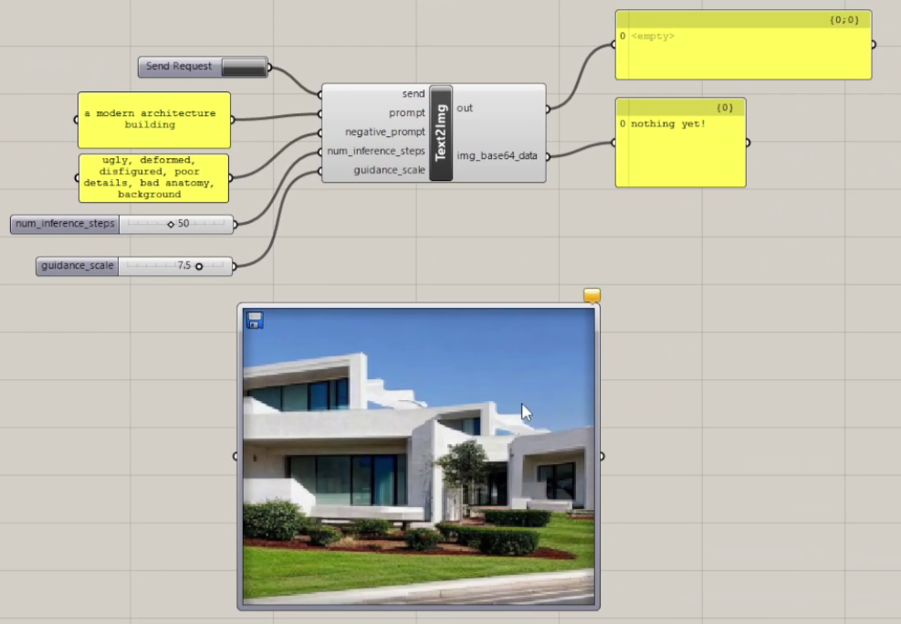
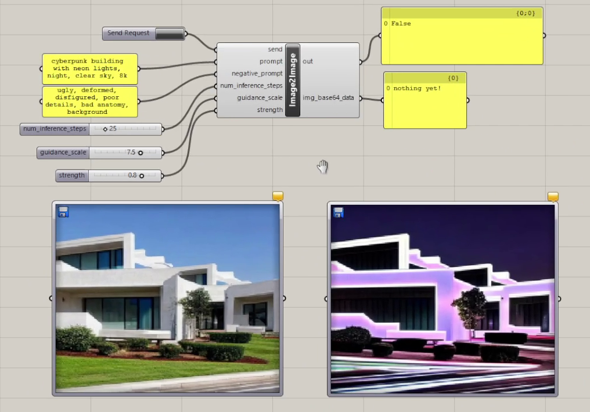

# Grasshopper Deep Learning Services
Deep learning models implemented as web services for integration in Rhino Grasshopper

## Demo Screenshots
### Text to Image


### Image to Image


### Demo Video
[Click here to download and play the demo video](./assets/demo_video.mp4)

## Examples
### Text to Image
**prompt: a traditional japanese house in a green garden**


### Image to Image
Using the image above as input, **prompt: cyberpunk building with neon lights, night**


# Use Locally
## Rhino Grasshopper Demo 
* Install Rhino (tested on Rhino 8 but Rhino 7 is also supported)
* Download **grasshopper_demo.gh** file to your working directory and open it with Rhino. 
* Right click Text2Img and Image2Image Grasshopper components and select "Open Script Editor". Here, edit the "save_path" for selecting image save folder and "URL" if server is running on remote machine.
* Edit the prompt (and other inputs) and click "Send Request" to send to the server. Depending on your hardware, response can take a while (GPUs are highly recommended for faster response). 

*NOTE: this demo only works in Rhino 8 (Python 3.x) environment. However, Python 2.x scripts are also provided but not fully tested. Python 2.x scripts end with **_p2.py**.*


## Setup Python Environment
### Create new conda environment
```bash
$ conda create -n ghdls python=3.11
```

### Activate created conda environment
```bash
$ conda activate ghdls
```

### Install dependencies (line by line)
```bash
$ cat requirements.txt | xargs -n 1 pip install
```

## Running Services in Docker Containers
### Install the NVIDIA Container Toolkit
**Docker containers with CUDA support are recommeded**

(from: https://docs.nvidia.com/datacenter/cloud-native/container-toolkit/latest/install-guide.html)

#### Configure the production repository:
```bash
$ curl -fsSL https://nvidia.github.io/libnvidia-container/gpgkey | sudo gpg --dearmor -o /usr/share/keyrings/nvidia-container-toolkit-keyring.gpg \
  && curl -s -L https://nvidia.github.io/libnvidia-container/stable/deb/nvidia-container-toolkit.list | \
    sed 's#deb https://#deb [signed-by=/usr/share/keyrings/nvidia-container-toolkit-keyring.gpg] https://#g' | \
    sudo tee /etc/apt/sources.list.d/nvidia-container-toolkit.list
```

#### Update the packages list from the repository:
```bash
$ sudo apt-get update
```

#### Install the NVIDIA Container Toolkit packages:
```bash
$ sudo apt-get install -y nvidia-container-toolkit
```

#### Check if CUDA works on Docker (Optional):
```bash
$ sudo docker run --rm --gpus all ubuntu:22.04 nvidia-smi
```

### Builiding the Docker Image
#### Build Docker image for Stable Diffusion 1.5 Text2Image and Image2Image
```bash
$ cd docker_img_files/sd_1_5_generic_server
$ docker build --tag t2i_i2i .
```

#### Create volumes for persistance
```bash
$ docker volume create \
--driver local \
-o o=bind \
-o type=none \
-o device="${HOME}/.docker_volues" \
t2i_i2i_volume
```

#### List available volumes (optional)
```bash
$ docker volume list
```

#### Start Docker image for Stable Diffusion 1.5 Text2Image and Image2Image
**NOTE: for the first run, models are downloaded. This can take some time (models are in GBs)**

Run bash

```bash
docker run -it --rm --gpus all -p 8000:8000 -v t2i_i2i_volume:/root t2i_i2i bash
```

Run as daemon

```bash
$ docker run -d --gpus all -p 8000:8000 -v t2i_i2i_volume:/root t2i_i2i 
```